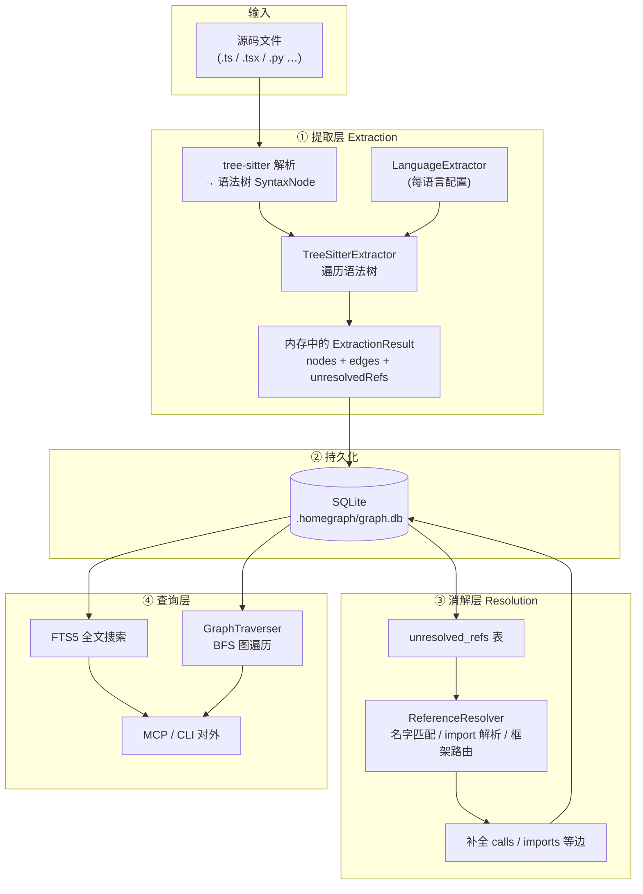
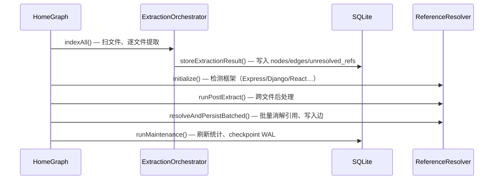
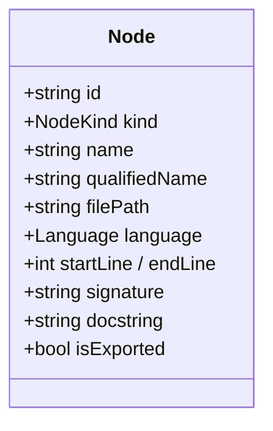
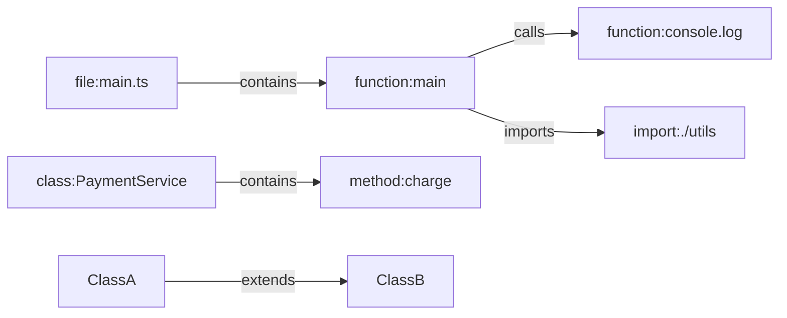
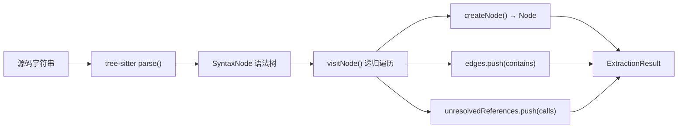
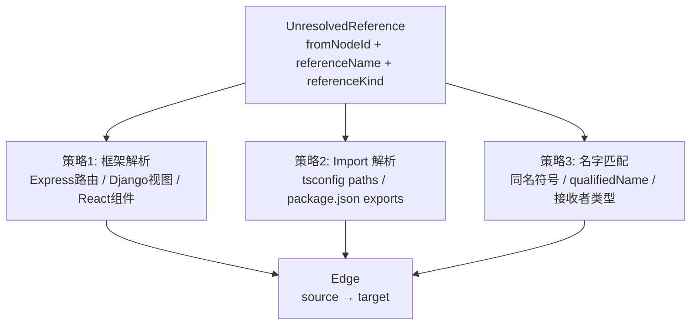
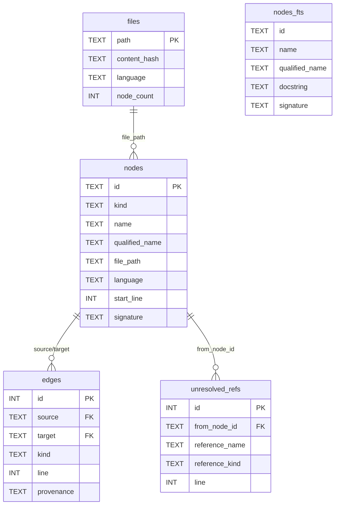
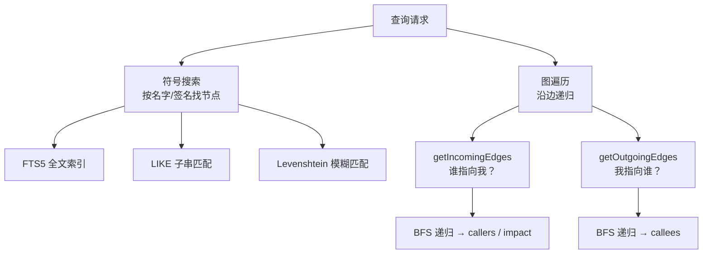
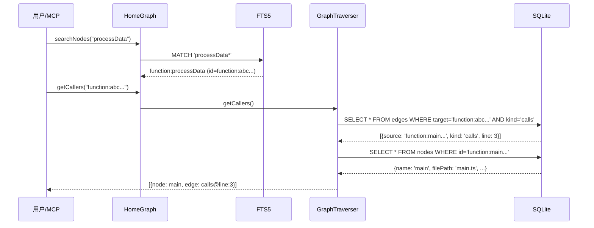

# HomeGraph 原理与实现洞察

> 本文档说明 HomeGraph **是什么、存什么、怎么表示、怎么构建、怎么查**，面向后续与自有分析器（如 ArkAnalyzer）结合前的原理性理解。  
> 重点在**认知模型与数据流**，而非接入细节。  
> **文中示例源码统一使用 TypeScript**（HomeGraph 原生支持 `typescript` / `tsx`）。

---

## 目录

- [0. 整体架构](#0-整体架构)
- [1. 实体（Node）](#1-实体node)
- [2. 关系（Edge）](#2-关系edge)
- [3. 构建：提取（Extraction）](#3-构建提取extraction)
- [4. 构建：消解（Resolution）](#4-构建消解resolution)
- [5. 存储（Storage）](#5-存储storage)
- [6. 查询（Query）](#6-查询query)
- [附录：关键文件索引](#附录关键文件索引)

---

## 0. 整体架构

### 0.1 核心定位

HomeGraph 把代码库建模为一张 **语义知识图**：

- **节点（Node）** = 程序符号（函数、类、方法、导入……），**不是** tree-sitter 的原始 AST 节点
- **边（Edge）** = 符号之间的语义关系（调用、包含、继承、导入……）
- 解析手段主要是 **tree-sitter**（WASM 语法分析器），**不是**各语言的完整编译器前端

### 0.2 架构图




### 0.3 主入口：`HomeGraph.indexAll()`

全量索引时，各层按顺序执行：




对应实现（`src/index.ts`）：

```typescript
// src/index.ts — indexAll() 核心流程（节选）
const result = await this.orchestrator.indexAll(...);

if (result.success && result.filesIndexed > 0) {
  this.resolver.initialize();       // 检测框架
  this.resolver.runPostExtract();   // 跨文件后处理
  await this.resolveReferencesBatched(...);  // 消解未解析引用
  this.db.runMaintenance();
}
```

### 0.4 关于「内存加速」


| 阶段  | 是否用内存    | 说明                                                     |
| --- | -------- | ------------------------------------------------------ |
| 提取  | ✅        | 每文件在内存中组装 `ExtractionResult`，再批量写库                     |
| 消解  | ✅ LRU 缓存 | `ReferenceResolver` 对节点名、import 映射等做 LRU 缓存（默认 5000 条） |
| 查询  | ⚠️ 小缓存   | `QueryBuilder` 对 `getNodeById` 有最多 1000 条的节点缓存         |
| 图遍历 | ❌ 无全图内存  | `GraphTraverser` 每次从 SQLite 取边，用 BFS 递归，**不把整张图载入内存**  |


**结论**：没有独立的「内存图数据库」层；查询本质是对 SQLite 的索引查询 + 应用层图遍历。

---

## 1. 实体（Node）

### 1.1 原理：存的是什么

节点表示 **从语法树中提取出的程序符号**，粒度是「可被引用、可被分析的结构单元」，例如：


| NodeKind              | 含义          | 示例                             |
| --------------------- | ----------- | ------------------------------ |
| `file`                | 源文件本身       | `service.ts`                   |
| `function`            | 顶层函数 / 箭头函数 | `processPayment`               |
| `method`              | 类方法         | `PaymentService.charge`        |
| `class` / `interface` | 类型定义        | `PaymentService` / `User`      |
| `import`              | 导入语句        | `'./utils'`                    |
| `namespace`           | 命名空间（部分语言）  | TS 通常无；Java/Kotlin 有 `package` |
| `route`               | 框架路由        | `POST /users`                  |


完整枚举见 `src/types.ts` 的 `NODE_KINDS`。

### 1.2 原理：怎么表示

一个 `Node` 由四部分组成：




**身份生成规则**（`generateNodeId`）：

```
id = "{kind}:{sha256(filePath:kind:name:line)[0:32]}"
```

### 1.3 示例：从 TypeScript 源码到 Node

#### 示例源代码

```typescript
// service.ts
export class PaymentService {
  private stripe: StripeClient;

  constructor(apiKey: string) {
    this.stripe = new StripeClient(apiKey);
  }

  async charge(amount: number): Promise<Receipt> {
    return this.stripe.charge(amount);
  }
}
```

#### tree-sitter 看到的语法树（简化）

```
program
├── export_statement
│   └── class_declaration "PaymentService"
│       ├── public_field_definition "stripe"   (private 修饰符在子节点)
│       ├── method_definition "constructor"
│       │   └── body
│       │       └── new_expression → "StripeClient"
│       └── method_definition "charge"
│           └── body
│               └── call_expression → "this.stripe.charge"
```

> **注意**：语法树节点（`method_definition`）≠ HomeGraph 节点。提取器**识别** `method_definition`，然后**创建**一个 `kind: 'method'` 的 Node。

#### 提取配置（TypeScript 语言告诉提取器「找哪些 AST 类型」）

```typescript
// src/extraction/languages/typescript.ts
export const typescriptExtractor: LanguageExtractor = {
  functionTypes: ['function_declaration', 'arrow_function', 'function_expression'],
  classTypes: ['class_declaration', 'abstract_class_declaration'],
  methodTypes: ['method_definition', 'public_field_definition'],
  interfaceTypes: ['interface_declaration'],
  enumTypes: ['enum_declaration'],
  typeAliasTypes: ['type_alias_declaration'],
  importTypes: ['import_statement'],
  callTypes: ['call_expression'],
  variableTypes: ['lexical_declaration', 'variable_declaration'],
  nameField: 'name',
  bodyField: 'body',
  getSignature: (node, source) => {
    const params = getChildByField(node, 'parameters');
    const returnType = getChildByField(node, 'return_type');
    // 如 "(amount: number): Promise<Receipt>"
  },
  isExported: (node) => {
    // 向上遍历父链，检查是否在 export_statement 下
  },
};
```

#### 创建 Node 的实现

```typescript
// src/extraction/tree-sitter.ts — createNode()
private createNode(kind: NodeKind, name: string, node: SyntaxNode, extra?: Partial<Node>): Node | null {
  const id = generateNodeId(this.filePath, kind, name, node.startPosition.row + 1);

  const newNode: Node = {
    id,
    kind,
    name,
    qualifiedName: this.buildQualifiedName(name),  // 如 "PaymentService.charge"
    filePath: this.filePath,
    language: this.language,
    startLine: node.startPosition.row + 1,
    endLine: node.endPosition.row + 1,
    startColumn: node.startPosition.column,
    endColumn: node.endPosition.column,
    updatedAt: Date.now(),
    ...extra,
  };

  this.nodes.push(newNode);

  // 自动添加 contains 边：父符号包含子符号
  if (this.nodeStack.length > 0) {
    this.edges.push({
      source: this.nodeStack[this.nodeStack.length - 1],
      target: id,
      kind: 'contains',
    });
  }
  return newNode;
}
```

#### 提取函数/方法的流程

```typescript
// src/extraction/tree-sitter.ts — extractFunction()（节选）
const funcNode = this.createNode('function', name, node, {
  docstring, signature, visibility, isExported,
});
this.nodeStack.push(funcNode.id);           // 入栈：后续子节点/调用归属此函数
this.visitFunctionBody(body, funcNode.id);  // 遍历函数体，提取 call_expression
this.nodeStack.pop();
```

#### 本例产出的 Node（概念示意）


| kind     | name             | qualifiedName                | startLine | isExported |
| -------- | ---------------- | ---------------------------- | --------- | ---------- |
| `file`   | `service.ts`     | `service.ts`                 | 1         | —          |
| `class`  | `PaymentService` | `PaymentService`             | 2         | `true`     |
| `method` | `constructor`    | `PaymentService.constructor` | 5         | —          |
| `method` | `charge`         | `PaymentService.charge`      | 9         | —          |


同时自动产生 `contains` 边：

```
file:service.ts ──contains──▶ class:PaymentService
class:PaymentService ──contains──▶ method:constructor
class:PaymentService ──contains──▶ method:charge
```

> 以上结构与 `__tests__/extraction.test.ts` 中 `extractFromSource('service.ts', code)` 的断言一致。

### 1.4 Node 类型定义（项目源码）

```typescript
// src/types.ts
export interface Node {
  id: string;              // 唯一标识，如 "function:a1b2c3..."
  kind: NodeKind;          // 'function' | 'method' | 'class' | ...
  name: string;            // 短名，如 "charge"
  qualifiedName: string;   // 限定名，如 "PaymentService.charge"
  filePath: string;        // 相对路径
  language: Language;      // 'typescript' | 'javascript' | ...
  startLine: number;       // 1-indexed
  endLine: number;
  startColumn: number;     // 0-indexed
  endColumn: number;
  docstring?: string;
  signature?: string;      // 如 "(amount: number): Promise<Receipt>"
  visibility?: 'public' | 'private' | 'protected' | 'internal';
  isExported?: boolean;
  // ...
}
```

---

## 2. 关系（Edge）

### 2.1 原理：关系是什么

边是有向的语义连接：`source → target`，类型由 `EdgeKind` 决定。




### 2.2 EdgeKind 全集

```typescript
// src/types.ts
export type EdgeKind =
  | 'contains'      // 包含：file→class, class→method
  | 'calls'         // 调用：funcA→funcB
  | 'imports'       // 导入：file→module
  | 'exports'       // 导出
  | 'extends'       // 继承
  | 'implements'    // 实现接口
  | 'references'    // 通用引用
  | 'type_of'       // 类型关系
  | 'returns'       // 返回类型
  | 'instantiates'  // 实例化：new Foo()
  | 'overrides'     // 方法重写
  | 'decorates';    // 装饰器
```

### 2.3 边的来源分两类


| 来源       | provenance        | 何时产生     | 示例                              |
| -------- | ----------------- | -------- | ------------------------------- |
| 提取阶段直接产生 | `tree-sitter`（默认） | 遍历 AST 时 | `contains` 边                    |
| 消解阶段补全   | 无 / `heuristic`   | 引用解析成功后  | `calls`、`imports` 边             |
| 启发式合成    | `heuristic`       | 动态分发推断   | React `setState→render`、JSX 子组件 |


### 2.4 示例：调用关系如何产生

#### 示例源代码

```typescript
// main.ts
function main() {
  const result = processData();
  console.log(result);   // ← 这里产生调用引用
}
```

#### 提取阶段：只记录「未解析引用」，还不连边

```typescript
// src/extraction/tree-sitter.ts — extractCall()（节选）
private extractCall(node: SyntaxNode): void {
  const callerId = this.nodeStack[this.nodeStack.length - 1];  // 当前所在函数 main
  // ... 从 call_expression 解析出 calleeName
  //     processData()        → "processData"
  //     console.log(result)  → "console.log"（member_expression 保留接收者名）
  if (calleeName) {
    this.unresolvedReferences.push({
      fromNodeId: callerId,
      referenceName: calleeName,    // "processData" 或 "console.log"
      referenceKind: 'calls',
      line: node.startPosition.row + 1,
      column: node.startPosition.column,
    });
  }
}
```

> 提取时**不知道** `processData` 对应哪个节点 ID，所以先记 `UnresolvedReference`，等全库索引完再消解。  
> 测试用例见 `__tests__/extraction.test.ts`：`extractFromSource('main.ts', code)` 断言 `referenceName === 'processData'`。

#### 消解成功后：变成真正的 Edge

```typescript
// src/resolution/index.ts — createEdges()
createEdges(resolved: ResolvedRef[]): Edge[] {
  return resolved.map((ref) => ({
    source: ref.original.fromNodeId,   // function:main 的 id
    target: ref.targetNodeId,          // function:processData 的 id
    kind: ref.original.referenceKind,  // 'calls'
    line: ref.original.line,
    column: ref.original.column,
  }));
}
```

#### Edge 类型定义

```typescript
// src/types.ts
export interface Edge {
  source: string;       // 源节点 id
  target: string;       // 目标节点 id
  kind: EdgeKind;
  metadata?: Record<string, unknown>;
  line?: number;        // 调用发生行号
  column?: number;
  provenance?: 'tree-sitter' | 'scip' | 'heuristic';
}
```

---

## 3. 构建：提取（Extraction）

### 3.1 原理

提取 = **tree-sitter 解析源码 → 遍历语法树 → 产出符号 + 部分边 + 未解析引用**。




### 3.2 单文件提取入口

```typescript
// src/extraction/tree-sitter.ts — extract()
extract(): ExtractionResult {
  const parser = getParser(this.language);       // 获取该语言的 tree-sitter Parser
  this.tree = parser.parse(this.source);         // 解析 → 语法树

  // 1. 创建 file 节点
  const fileNode: Node = { id: `file:${this.filePath}`, kind: 'file', ... };
  this.nodes.push(fileNode);
  this.nodeStack.push(fileNode.id);

  // 2. 递归遍历语法树
  this.visitNode(this.tree.rootNode);

  return { nodes: this.nodes, edges: this.edges, unresolvedReferences: this.unresolvedReferences, ... };
}
```

### 3.3 visitNode：根据 AST 节点类型分发

```typescript
// src/extraction/tree-sitter.ts — visitNode()（节选）
private visitNode(node: SyntaxNode): void {
  const nodeType = node.type;  // 如 "function_declaration", "call_expression"

  if (this.extractor.functionTypes.includes(nodeType)) {
    this.extractFunction(node);       // → createNode('function', ...)
    skipChildren = true;
  } else if (this.extractor.methodTypes.includes(nodeType)) {
    this.extractMethod(node);         // → createNode('method', ...)
    skipChildren = true;
  } else if (this.extractor.callTypes.includes(nodeType)) {
    this.extractCall(node);           // → unresolvedReferences.push(...)
  } else if (this.extractor.importTypes.includes(nodeType)) {
    this.extractImport(node);         // → createNode('import', ...) + unresolved ref
  }
  // ... struct, enum, class, variable 等

  if (!skipChildren) {
    for (const child of node.namedChildren) this.visitNode(child);
  }
}
```

### 3.4 写入数据库

```typescript
// src/extraction/index.ts — storeExtractionResult()
private storeExtractionResult(filePath, content, language, stats, result): void {
  const contentHash = hashContent(content);
  const existingFile = this.queries.getFileByPath(filePath);
  if (existingFile?.contentHash === contentHash) return;  // 未改动，跳过

  if (existingFile) this.queries.deleteFile(filePath);    // 删旧数据

  this.queries.insertNodes(validNodes);
  this.queries.insertEdges(validEdges);
  this.queries.insertUnresolvedRefsBatch(refsWithContext);
  this.queries.upsertFile(fileRecord);
}
```

### 3.5 端到端示例

**输入** `main.ts`：

```typescript
import { greet } from './utils';

function main() {
  console.log(greet('hi'));
}
```

**提取产出（概念）**：

```
Nodes:
  file:main.ts
  import:"./utils"
  function:main

Edges (提取阶段直接产生):
  file ──contains──▶ import
  file ──contains──▶ function

UnresolvedReferences (待消解):
  function:main ──calls──▶ "console.log"   (还不知道目标节点 id)
  function:main ──calls──▶ "greet"         (通过 import 消解后连到 utils.ts 中的函数)
  file ──imports──▶ "./utils"              (还不知道 utils 模块导出哪些符号)
```

### 3.6 tree-sitter 提取边界：做什么 / 不做什么

tree-sitter 给的是**语法树**，不是类型系统。`TreeSitterExtractor` 递归遍历语法树，把**有名字的程序符号**落成 `Node`，把**能静态看到的结构关系**落成 `Edge` 或 `unresolvedReferences`。  
核心实现见 `src/extraction/tree-sitter.ts`；每种语言通过 `src/extraction/languages/*.ts` 里的 `LanguageExtractor` 配置「哪些 AST 节点类型算函数、类、变量……」。

一句话概括：**结构递归完整，语义刻意保守**——嵌套的 namespace / class / 方法体都会走进去，但方法内的局部变量、匿名回调等会主动跳过，避免图爆炸。

#### 3.6.1 会提取什么（按作用域）

| 作用域 | 会落成 Node 的符号 | `NodeKind` 示例 | 说明 |
|--------|-------------------|-----------------|------|
| 文件 | 文件本身 | `file` | 每个源文件一个根节点 |
| 文件 / namespace | `package` / `namespace` 声明 | `namespace` | Java `package`、C# `namespace`、PHP `namespace` 等；块级 namespace 会**递归**进入子块，子声明挂在父 namespace 下 |
| 模块顶层 | 函数、类、接口、枚举、类型别名、const/let/var | `function` `class` `interface` `enum` `type_alias` `variable` `constant` | `export` 修饰通过父链 `export_statement` 识别，写入 `isExported` |
| 类 / 接口 / 结构体内部 | 方法、字段、属性、枚举成员 | `method` `field` `property` `enum_member` | 语言各异：TS 用 `method_definition` / `public_field_definition`；Java 用 `field_declaration` |
| 类 / 接口内部 | 类型别名、索引签名 | `type_alias` `property` | TS `type X = { ... }` 会把 object 成员拆成子 `property` / `method`；`[key: string]: T` 落成 `property` |
| 函数体内部（有限） | **具名**嵌套函数 | `function` | `function onmount() {}`、`.on('x', function handler(){})` 会单独建节点 |
| 函数体内部（有限） | Java/C# 匿名类 | `class`（合成名） | `new Runnable() { ... }` → `<Runnable$anon@42>`，体内 override 方法照常提取 |
| 导入 | import / export 语句 | `import` | 模块路径写入 `signature`；跨文件目标在消解阶段才连边 |

#### 3.6.2 提取阶段会记录什么边

| 边 / 引用 | 何时产生 | 提取时是否已解析到目标 id |
|-----------|----------|---------------------------|
| `contains` | 父符号包含子符号（file → class → method） | ✅ 同一文件内直接写入 |
| `calls` | 遍历到 `call_expression` 等 | ❌ 先写入 `unresolvedReferences`，消解后变真边 |
| `imports` / `exports` | import 语句、re-export | ❌ 多数先 unresolved |
| `extends` / `implements` | 继承子句、匿名类的父类型 | 部分 unresolved |
| `references` | 类型注解、装饰器、静态成员读取 | 部分 unresolved |
| `decorates` | `@Decorator` 应用到声明 | unresolved |

> 提取层只负责「我看到源码里写了什么名字」；「这个名字到底指向哪个文件里的哪个符号」是第 4 节消解层的工作。

#### 3.6.3 故意不提取什么

| 类别 | 典型源码 | 为什么不建 Node |
|------|----------|----------------|
| **方法内局部变量** | `const x = 1`、`let items: Foo[] = []` | 每个 local 都建节点会让大图仓库节点数爆炸；属于**数据流前沿**，刻意留空 |
| **匿名函数** | `() => {}`、`function() {}`（未绑定变量名） | 不建节点，但**仍会走进函数体**，把里面的 `call` 和具名子函数提出来 |
| **AST 自身** | 任意 `SyntaxNode` | 图里存的是**符号**，不是语法树节点 |
| **语义推断** | 泛型实例化、控制流、常量折叠 | tree-sitter 不做类型检查，也不做数据流分析 |
| **动态派发** | `obj[methodName]()`、回调链、React 重渲染 | 提取阶段看不到静态目标；部分场景由消解层的框架/启发式补边（见第 4 节） |
| **宏 / 预处理产物** | C++ `#define` 展开前的伪函数 | 可能误判为函数；部分语言用 `isMisparsedFunction` 跳过节点但仍扫函数体 |

#### 3.6.4 折中：不建节点，但记依赖

有些语法**不值得单独建符号**，但外层函数确实依赖它们——提取器用 `references` 边「点名」而不建 local 节点：

```typescript
function load(): Node[] {
  const items: Node[] = [];   // ← items 本身不是 Node
  return items;               // ← 但 function:load ──references──▶ type:Node 会记录
}
```

同理，方法体内的**具名**嵌套函数会建节点；**匿名**箭头函数不建节点，其内部的 `call` 仍归属外层函数：

```typescript
export function setup() {
  // ✅ 提取为 function:helper（嵌套具名函数）
  function helper() { fetch('/api'); }

  // ❌ 不提取箭头本身；✅ fetch 的 calls 记在 setup 上
  [1, 2].forEach((n) => { console.log(n); });

  // ✅ 变量声明右侧的箭头：名字来自 declarator → function:useAuth
  const useAuth = () => { return token; };
}
```

#### 3.6.5 变量提取的精确规则（TypeScript 代表）

`visitNode` 对 `lexical_declaration` / `variable_declaration` 的分发条件：

```typescript
// src/extraction/tree-sitter.ts（逻辑摘要）
else if (this.extractor.variableTypes.includes(nodeType)
         && !this.isInsideClassLikeNode()) {
  this.extractVariable(node);  // 只提取「不在 class 里面」的顶层/模块级变量
}
```

| 位置 | 示例 | 是否提取为 `variable` / `constant` |
|------|------|--------------------------------------|
| 模块顶层 | `const MAX = 100` | ✅ |
| namespace 块内顶层 | `namespace N { const X = 1 }` | ✅（在 namespace 作用域下） |
| 类字段 | `class C { label = 'x' }` | ✅，但是 `property` / `field`，走字段提取器 |
| 方法体内 | `run() { const tmp = 1 }` | ❌（仅类型注解可能产生 `references`） |

#### 3.6.6 一图对照：同一段代码的提取结果

```typescript
export namespace App {
  export type Id = string;

  export class Service {
    static MAX = 10;           // → constant（类级静态字段）

    run(): void {
      const buf: Buffer[] = []; // → 无 Node；run ──references──▶ Buffer
      this.format();
    }

    private format(): void {}
  }

  export function main() {
    new Service().run();
  }
}
```

| 源码片段 | 提取产物 |
|----------|----------|
| `namespace App` | `namespace:App`（`file ──contains──▶ namespace:App`） |
| `type Id = string` | `type_alias:Id`（挂在 `App` 下） |
| `class Service` | `class:Service` |
| `static MAX = 10` | `constant:MAX`（挂在 `Service` 下） |
| `run` / `format` | `method:run`、`method:format` |
| `const buf` | **无节点**；`run ──references──▶ Buffer` |
| `main` | `function:main` |
| `new Service().run()` | `main ──calls──▶ run`（unresolved → 消解后连边） |

#### 3.6.7 与「完整编译器前端」的边界

| 能力 | tree-sitter 提取 | 完整语义分析（对比参照） |
|------|------------------|-------------------------|
| 语法结构遍历 | ✅ 递归完整 | ✅ |
| 跨文件符号绑定 | 消解层尽力匹配，非类型级 | ✅ 严格 |
| 方法内局部符号 | ❌ 故意跳过 | ✅ |
| 匿名 / 内部合成符号 | 大部分跳过；Java/C# 匿名类例外 | 视实现而定 |
| 调用图精度 | 静态可见调用 + 框架启发式 | RTA / PTA 等 |

设计取向：**用较少的节点覆盖「改一个符号会影响谁」这类结构问题**，而不是复刻 IDE 级语义索引。若后续接入自有分析器，应优先对齐这张表的「做 / 不做」边界，再谈增量能力。

---

## 4. 构建：消解（Resolution）

### 4.1 原理

消解解决的核心问题：**「这里引用了名字 X，它对应图里哪个节点？」**




### 4.2 消解流程

```typescript
// src/resolution/index.ts — resolveOne()（节选）
resolveOne(ref: UnresolvedRef): ResolvedRef | null {
  // 策略1: 框架专用（Express 路由 → handler 函数）
  for (const framework of this.frameworks) {
    const result = framework.resolve(ref, this.context);
    if (result?.confidence >= 0.9) return result;
  }

  // 策略2: 通过 import 映射解析
  const importResult = resolveViaImport(ref, this.context);
  if (importResult) return importResult;

  // 策略3: 名字匹配（同名函数、接收者.方法名）
  const nameResult = matchReference(ref, this.context);
  if (nameResult) return nameResult;

  return null;  // 无法解析，保留或清理
}
```

### 4.3 名字匹配示例

```typescript
// src/resolution/name-matcher.ts — matchReference() 思路
// 给定 referenceName = "this.stripe.charge"，在上下文中：
// 1. 查找名为 "charge" 的 method 节点
// 2. 结合接收者类型 "StripeClient" 缩小候选
// 3. 返回 { targetNodeId, confidence: 0.85, resolvedBy: 'name-match' }

// 给定 referenceName = "greet" + import './utils'：
// resolveViaImport 将 './utils' 映射到 utils.ts，再在其中找名为 greet 的 function
```

### 4.4 消解后持久化

```typescript
// src/resolution/index.ts — resolveAndPersist()
resolveAndPersist(unresolvedRefs, onProgress): ResolutionResult {
  const result = this.resolveAll(unresolvedRefs, onProgress);
  const edges = this.createEdges(result.resolved);

  if (edges.length > 0) {
    this.queries.insertEdges(edges);           // 写入 calls/imports 等边
  }
  this.queries.deleteSpecificResolvedReferences(...);  // 从 unresolved_refs 表删除
  return result;
}
```

### 4.5 示例：消解前后对比

**消解前**（`unresolved_refs` 表）：


| from_node_id      | reference_name | reference_kind | line |
| ----------------- | -------------- | -------------- | ---- |
| `function:abc...` | `processData`  | `calls`        | 3    |
| `function:abc...` | `console.log`  | `calls`        | 4    |


**消解后**（`edges` 表新增一行）：


| source            | target            | kind    | line |
| ----------------- | ----------------- | ------- | ---- |
| `function:abc...` | `function:def...` | `calls` | 4    |


同时 `unresolved_refs` 中对应行被删除。

---

## 5. 存储（Storage）

### 5.1 原理：存的是什么

持久化的是 **知识图的序列化形式**，存在项目目录 `.homegraph/graph.db`（SQLite）。




### 5.2 核心表说明


| 表                 | 存什么                  | 作用          |
| ----------------- | -------------------- | ----------- |
| `nodes`           | 所有符号实体               | 图顶点         |
| `edges`           | 所有关系                 | 图边          |
| `files`           | 文件元数据 + content_hash | 增量索引、跳过未改文件 |
| `unresolved_refs` | 待消解引用                | 消解阶段的输入队列   |
| `nodes_fts`       | FTS5 虚拟表             | 全文搜索索引      |


### 5.3 触发器：自动同步搜索库

插入/更新/删除 `nodes` 时，触发器自动维护 `nodes_fts`：

```sql
-- src/db/schema.sql
CREATE TRIGGER IF NOT EXISTS nodes_ai AFTER INSERT ON nodes BEGIN
    INSERT INTO nodes_fts(rowid, id, name, qualified_name, docstring, signature)
    VALUES (NEW.rowid, NEW.id, NEW.name, NEW.qualified_name, NEW.docstring, NEW.signature);
END;

CREATE TRIGGER IF NOT EXISTS nodes_au AFTER UPDATE ON nodes BEGIN
    -- 先 delete 旧索引，再 insert 新索引
    INSERT INTO nodes_fts(nodes_fts, rowid, id, ...) VALUES ('delete', OLD.rowid, ...);
    INSERT INTO nodes_fts(rowid, id, name, ...) VALUES (NEW.rowid, NEW.id, NEW.name, ...);
END;
```

### 5.4 写入实现

```typescript
// src/db/queries.ts — insertNode()
insertNode(node: Node): void {
  this.stmts.insertNode.run({
    id: node.id,
    kind: node.kind,
    name: node.name,
    qualifiedName: node.qualifiedName,
    filePath: node.filePath,
    language: node.language,
    startLine: node.startLine,
    // ...
  });
  // INSERT 触发 nodes_ai → 自动更新 nodes_fts
}
```

### 5.5 索引策略

```sql
-- B-tree 索引：加速按类型/名字/文件查节点
CREATE INDEX idx_nodes_kind ON nodes(kind);
CREATE INDEX idx_nodes_name ON nodes(name);
CREATE INDEX idx_nodes_file_path ON nodes(file_path);

-- 复合索引：加速图遍历（按 source/target + kind 查边）
CREATE INDEX idx_edges_source_kind ON edges(source, kind);
CREATE INDEX idx_edges_target_kind ON edges(target, kind);
```

### 5.6 增量更新原理

```
文件改动 → 重新计算 content_hash
  ├─ hash 相同 → 跳过（不重新提取）
  └─ hash 不同 → deleteFile(path) 删该文件所有 nodes/edges/refs → 重新提取写入
```

---

## 6. 查询（Query）

### 6.1 原理

查询 = **在持久化的图上做操作**，分两类：




### 6.2 符号搜索

```typescript
// src/db/queries.ts — searchNodes()
searchNodes(query: string, options?: SearchOptions): SearchResult[] {
  // 1. FTS5 前缀匹配（最快）
  let results = this.searchNodesFTS(text, { kinds, languages, limit });

  // 2. 无结果 → LIKE 子串
  if (results.length === 0) results = this.searchNodesLike(text, ...);

  // 3. 仍无结果 → 模糊匹配（编辑距离）
  if (results.length === 0) results = this.searchNodesFuzzy(text, ...);

  return results;
}
```

**示例**：搜索 `kind:method charge`

```sql
-- FTS5 底层大致等价于：
SELECT n.*, bm25(nodes_fts) AS score
FROM nodes_fts
JOIN nodes n ON nodes_fts.id = n.id
WHERE nodes_fts MATCH 'charge*'
  AND n.kind = 'method'
ORDER BY score
LIMIT 100;
```

### 6.3 图遍历：callers / callees

```typescript
// src/graph/traversal.ts — getCallers()
getCallers(nodeId: string, maxDepth: number = 1): Array<{ node: Node; edge: Edge }> {
  // 1. 查所有指向 nodeId 的 calls/references/imports 边
  const incomingEdges = this.queries.getIncomingEdges(nodeId, ['calls', 'references', 'imports']);

  // 2. 批量取源节点
  const callerNodes = this.queries.getNodesByIds(sourceIds);

  // 3. BFS 递归（深度 maxDepth）
  for (const edge of incomingEdges) {
    result.push({ node: callerNode, edge });
    this.getCallersRecursive(callerNode.id, maxDepth, currentDepth + 1, ...);
  }
  return result;
}
```

底层 SQL：

```sql
-- getIncomingEdges('method:abc...', ['calls'])
SELECT * FROM edges WHERE target = ? AND kind IN ('calls');
```

### 6.4 查询示例：「谁调用了 processData？」




### 6.5 对外接口


| 层     | 入口                            | 用途                                                                                                                                                                                                          |
| ----- | ----------------------------- | ----------------------------------------------------------------------------------------------------------------------------------------------------------------------------------------------------------- |
| 库 API | `HomeGraph` 类（`src/index.ts`） | 索引：`init`/`indexAll`/`sync`/`watch`；查询：`searchNodes`、`getCallers`/`getCallees`、`getImpactRadius`、`findPath`、`traverse`；上下文：`buildContext`/`getContext`/`findRelevantContext`；统计：`getStats`、`findDeadCode` 等 |
| CLI   | 见下表                           | 命令行索引与查询                                                                                                                                                                                                    |
| MCP   | 见下表                           | AI Agent 工具（`homegraph serve mcp` 启动）                                                                                                                                                                     |


**CLI 子命令（完整）**


| 类别   | 命令                                                                 | 用途                                               |
| ---- | ------------------------------------------------------------------ | ------------------------------------------------ |
| 安装   | `install` / `uninstall` / `upgrade [version]`                      | 向 Cursor/Claude/Codex 等 Agent 安装或卸载 MCP；升级 npm 包 |
| 生命周期 | `init [path]` / `uninit [path]`                                    | 初始化或移除项目 `.homegraph/`                           |
| 索引   | `index [path]` / `sync [path]` / `status [path]` / `unlock [path]` | 全量索引、增量同步、查看状态、解除索引锁                             |
| 查询   | `query <search>`                                                   | FTS 符号搜索                                         |
| 查询   | `files [options]`                                                  | 列出已索引文件树                                         |
| 查询   | `callers <symbol>` / `callees <symbol>` / `impact <symbol>`        | 调用者、被调用者、影响半径                                    |
| 查询   | `affected [files...]`                                              | 根据改动文件找受影响的测试                                    |
| 服务   | `serve mcp [--path]`                                             | 以 MCP stdio 模式启动（Agent 实际走这条）                    |


> 说明：CLI 头注释里写过 `context <task>`，当前 **未注册** 该子命令；等价能力在库 API 的 `buildContext` 和 MCP 的 `homegraph_explore` 里。

**MCP 工具（完整，共 8 个）**
| MCP 工具 | 用途 | 核心调用链 | 核心 SQL |
| ---- | ---- | ---- | ---- |
| `homegraph_explore` | 工具主入口，支持通过自然语言、符号名称集合检索内容；可返回符号原始源码并按文件分组展示，同时支持生成Flow调用路径，能解析并合成动态dispatch调用边，完整还原代码调用关系。 | MCP → `findRelevantContext`（精确名 + FTS + 子图遍历）→ 命名符号注入（`getNodesByName` / `findAllSymbols`）→ 同文件 glue（`getCallers`/`getCallees`）→ `buildFlowFromNamedSymbols`（calls 边 BFS）→ `getCode` 读磁盘源码 → 格式化输出 | `nodes_fts MATCH ?`（FTS）；`nodes WHERE name = ?`（精确名）；`edges WHERE source/target = ?`；`SELECT * FROM nodes WHERE id IN (…)` |
| `homegraph_node` | 工具次入口，针对单个符号进行查询，展示符号签名、代码所在位置，也可查看完整文本；遇到函数/方法重载场景时，会一次性返回所有重载定义，额外附带一层调用方与被调用方简易链路。 | MCP → `findSymbolMatches`（裸名 `getNodesByName`，限定名 FTS+过滤）→ 可选 `getCode` 读文件 → `getCallers`/`getCallees`（depth=1）→ 格式化 | 裸名：`SELECT * FROM nodes WHERE name = ?`；限定名：`nodes_fts MATCH ?` JOIN `nodes`；trail：`edges WHERE target/source = ?` |
| `homegraph_search` | 关键词快速检索工具，仅定位代码符号，返回符号签名与所在位置信息，**不加载、不展示源码内容**，检索速度快，适合快速筛选目标符号。 | MCP → `HomeGraph.searchNodes` → FTS（失败则 LIKE 兜底）→ 去重/降权生成文件 | `nodes_fts MATCH ?` JOIN `nodes`（BM25 排序）；兜底：`nodes WHERE name LIKE ? OR qualified_name LIKE ?` |
| `homegraph_callers` | 专门查询目标符号的调用者与依赖项，默认查询深度为1；可自动识别同名重载符号并对结果进行聚合合并，清晰梳理哪些代码引用、调用了当前符号。 | MCP → `findAllSymbols`（FTS 解析 symbol）→ 对每个匹配节点 `getCallers` → 去重 | `edges WHERE target = ? AND kind IN ('calls','references','imports')`；`SELECT * FROM nodes WHERE id IN (…)` |
| `homegraph_callees` | 反向查询工具，查看目标符号内部调用、引用、导入的其他符号，默认查询深度为1，直观展示当前代码内部的依赖对象。 | MCP → `findAllSymbols` → 对每个匹配节点 `getCallees` → 去重 | `edges WHERE source = ? AND kind IN ('calls','references','imports')`；`SELECT * FROM nodes WHERE id IN (…)` |
| `homegraph_impact` | 影响范围分析工具，用于评估修改某个符号带来的变更影响；默认递归向上遍历2层上游依赖链，遍历过程会跳过容器包含类关系，同时自动展开容器内部子成员，整合输出完整影响子图。 | MCP → `findAllSymbols` → `getImpactRadius`（递归沿**入边**向上，跳过 `contains`；容器类会展开子成员）→ 合并子图 | 递归：`edges WHERE target = ? AND kind != 'contains'`；节点批量：`SELECT * FROM nodes WHERE id IN (…)` |
| `homegraph_files` | 索引文件管理工具，列出所有已完成索引的文件目录树；支持按编程语言筛选、统计单文件内符号数量，可配置路径匹配规则与目录遍历深度，所有过滤逻辑在内存中完成。 | MCP → `getFiles()` 取全量 → **内存**按 path 前缀 / glob 过滤 → 组装 tree/flat/grouped | `SELECT * FROM files`（+ JOIN `nodes` 计符号数）；无 `LIKE` 下推 |
| `homegraph_status` | 索引健康状态巡检工具，统计文件、节点、关系边的总数量；按类型、编程语言做分类统计，同时展示数据库后端信息、日志模式以及尚未完成同步的文件列表。 | MCP → `getStats` + `getPendingFiles` + `getJournalMode` | `SELECT COUNT(*) FROM nodes/edges/files`；`SELECT kind, COUNT(*) FROM nodes GROUP BY kind`；`SELECT language, COUNT(*) FROM files GROUP BY language` |


## 7 真实示例

本节用图库仓的一次真实 Agent 会话，说明 **Agent 与 MCP 各自负责什么**。MCP 只做结构化查询并返回文本；Agent 负责理解用户意图、从自然语言里抽出符号名、选工具、串联多次调用、把返回整理成答案。

```
用户自然语言
    → Agent 理解任务、抽符号、选工具
    → IDE 转发 MCP tools/call（JSON 入参）
    → HomeGraph 返回 markdown 文本
    → Agent 判断是否够用；不够则再调 MCP
    → Agent 写最终结论
```

以下 `projectPath` 均指图库仓根目录（已 `homegraph init` 并索引）。当前项目内查询时可省略。

### 7.1 用户任务

- **代码仓**：图库仓（HarmonyOS / ArkTS）
- **用户输入（自然语言）**：完整理解 `AlbumUtils.useNewPhotoGrid()`——它判断是否走「新照片网格」UI；在哪定义、被哪些页面调用、内部调了谁、改它会影响谁。

用户说的是一整段任务描述；**不会**直接把这段话传给 MCP。

### 7.2 第一轮：`homegraph_explore`

**Agent 做了什么**

- 把用户问题拆成四个子问题：定义在哪、谁调用、内部调谁、改动影响面。
- 从 `AlbumUtils.useNewPhotoGrid()` 抽出两个符号名：`AlbumUtils`、`useNewPhotoGrid`。
- 选择 PRIMARY 工具 `homegraph_explore`（一次调用尽量拿到定义 + 相关源码 + 调用关系概览）。
- 通过 IDE 发起 MCP 调用（Cursor 会把 Agent 的 tool call 转成 `tools/call` 发给 `homegraph serve mcp` 子进程）。

**MCP 入参**

```json
{
  "query": "AlbumUtils useNewPhotoGrid",
  "projectPath": "/path/to/gallery-repo"
}
```

| 字段 | 必填 | 说明 |
| --- | --- | --- |
| `query` | 是 | 空格分隔的符号/文件名，不是用户的整段自然语言 |
| `maxFiles` | 否 | 最多返回几个文件的源码（默认 12） |
| `projectPath` | 否 | 查别的已索引仓库时用；当前项目可省略 |

**MCP 返回（摘要）**

- 命中 186 个相关符号，涉及 59 个文件。
- Flow / Blast radius 段提到约 12 个 caller，但未给出完整列表。
- `AlbumUtils.ets` 中 `useNewPhotoGrid` 的方法体：**第 90–101 行**，其中 93–99 行被输出 budget 截断（gap）。
- 其余 58 个文件的源码块大多与任务无关；整体输出在 budget 处截断。

**Agent 读返回后的判断**

- 已确认：方法在 `AlbumUtils.ets` 第 90 行，返回 boolean，与「新照片网格」相关。
- 仍缺：完整 caller 列表、完整 callee 列表、改动影响面、被截断的方法体中间分支。
- 决定：分别调用 `homegraph_callers`、`homegraph_callees`、`homegraph_impact` 补全；必要时用 `homegraph_node` 补源码。

### 7.3 第二轮：`homegraph_callers`

**Agent 做了什么**

- explore 的 Blast radius 只写了「约 12 个 caller」，没有逐条列出文件:行。
- 用已确认的方法名 `useNewPhotoGrid` 调专用工具，要完整 caller 列表。

**MCP 入参**

```json
{
  "symbol": "useNewPhotoGrid",
  "limit": 12,
  "projectPath": "/path/to/gallery-repo"
}
```

**MCP 返回（摘要）**

- 12 条 caller，每条含符号名、`file:line`、调用上下文（见第 3 节 callers 返回格式）。
- 例如：`AlbumPhotoGridLoader.ets:22`、`TimelinePageLoader.ets:23`、`GroupGridView.build:309` 等。

**Agent 读返回后的判断**

- 「被谁调」已齐，可写入最终答案的 caller 段。

### 7.4 第三轮：`homegraph_callees`

**Agent 做了什么**

- 用户还问「内部调了谁」；explore 因 budget 截断，方法体中间分支不完整。
- 调 `homegraph_callees` 从图里直接列出该方法调用的符号。

**MCP 入参**

```json
{
  "symbol": "useNewPhotoGrid",
  "projectPath": "/path/to/gallery-repo"
}
```

**MCP 返回（摘要）**

- 7 条 callee，例如 `DeviceInfo.isEmulator`、`DeviceInfo.isFoldDevice`、`SystemPropertiesManager.get` 等。

**Agent 读返回后的判断**

- 结合 explore 里未截断的行（90–93、100–101）与 callee 列表，可以还原方法逻辑：模拟器直接 true，否则按设备形态读系统属性 `PERSIST_NEW_PHOTO_GRID_VIEW`。

### 7.5 第四轮：`homegraph_impact`

**Agent 做了什么**

- 用户问「改它会影响谁」；callers 只覆盖直接调用方，不够回答 refactor 风险。
- 调 `homegraph_impact`，`depth: 2` 看两层依赖传播。

**MCP 入参**

```json
{
  "symbol": "useNewPhotoGrid",
  "depth": 2,
  "projectPath": "/path/to/gallery-repo"
}
```

**MCP 返回（摘要）**

- 共 36 个受影响符号：12 个直接 caller，外加各 `*DataSource.constructor`、`TabContentComponent.build`、`PhotoGridViewBuilder.build` 等间接依赖。

**Agent 读返回后的判断**

- 「改动影响面」已齐；可说明改返回值会改变多处 Grid 新旧分支选择。

### 7.6 第五轮：`homegraph_node`（可选补洞）

**Agent 做了什么**

- explore 返回的方法体中间有 gap；callees 已补全逻辑，但 Agent 仍尝试用 `homegraph_node` 拉完整源码。
- 传入 `file: "AlbumUtils.ets"` 消歧——仓库里可能有同名符号。

**MCP 入参**

```json
{
  "symbol": "useNewPhotoGrid",
  "includeCode": true,
  "file": "AlbumUtils.ets",
  "projectPath": "/path/to/gallery-repo"
}
```

**MCP 返回（摘要）**

- 定位到 `AlbumUtils.ets:90`，但完整 body 仍因索引/输出限制只返回一行签名 + Trail（caller/callee 链与 7.3、7.4 一致）。

**Agent 读返回后的判断**

- 不再继续调 MCP；已有 explore 首尾行 + callees + callers + impact，足够写结论。

### 7.7 若只有 MCP、没有 Agent

没有 Agent 时，不会有人把「完整理解…在哪定义、被谁调…」传给 MCP。你需要**自己**决定调哪些工具、**自己**写符号名，例如：

```json
{ "query": "AlbumUtils useNewPhotoGrid" }
{ "symbol": "useNewPhotoGrid", "limit": 12 }
{ "symbol": "useNewPhotoGrid" }
{ "symbol": "useNewPhotoGrid", "depth": 2 }
{ "symbol": "useNewPhotoGrid", "includeCode": true, "file": "AlbumUtils.ets" }
```

MCP 返回的是结构化查询结果的 markdown 文本，**不会**自动合成 7.8 那样的自然语言报告。

### 7.8 Agent 结论（最终输出）

AlbumUtils.useNewPhotoGrid() 是 common/src/main/ets/default/utils/AlbumUtils.ets 第 90 行的静态方法，返回 boolean，用来决定当前设备是否走新照片网格框架。

做什么： 模拟器直接返回 true；其余情况根据 DeviceInfo 判断设备形态（折叠屏/GRL/手机 UX/平板），再读 SystemPropertiesManager 里 PERSIST_NEW_PHOTO_GRID_VIEW 系统属性（explore 返回的源码 90–93、100–101 行；中间分支被 budget 截断，callee 侧可确认还调了 isFoldDevice、isGRLFoldScreen、isPhoneUx、isTablet）。

被谁调（12 处）： AlbumPhotoGridLoader.ets:22、AlbumTabletGirdLoader.ets:23、TimelinePageLoader.ets:23、TimelineTabletPageLoader.ets:21、GroupGridView.build:309、index.aboutToAppear:902、OtherAlbumPage 的 onBackPressFunc/PhotoGridViewLoader、PhotoGridBasePage.PhotoGridViewLoader:365、
TimelineDataSource.constructor:440、AlbumSetPage.onPickerOperationBackToNewAlbum:593、AlbumSetRenameMenuOperation.rename:173。

内部调谁（7 处）： DeviceInfo.isEmulator / isFoldDevice / isGRLFoldScreen / isPhoneUx / isTablet，SystemPropertiesManager.getInstance / get。

改它会影响谁（depth=2，36 个符号）： 上述 12 个直接 caller，外加 20+ 个 *DataSource.constructor（AlbumDataSource、MediaDataSource、TimelineDataSourceProxy 等）和 TabContentComponent.build、AlbumPhotoView.build、PhotoGridViewBuilder.build 等间接依赖方。改返回值会改变这些入口/DataSource 初始化时选旧 Grid 还是新 Grid 的分支。

## 附录：关键文件索引


| 模块         | 文件                                         | 职责                                                 |
| ---------- | ------------------------------------------ | -------------------------------------------------- |
| 类型定义       | `src/types.ts`                             | `Node`, `Edge`, `NodeKind`, `EdgeKind`             |
| 提取核心       | `src/extraction/tree-sitter.ts`            | `TreeSitterExtractor`, `createNode`, `extractCall` |
| 语言配置       | `src/extraction/languages/typescript.ts` 等 | 每语言的 `LanguageExtractor`                           |
| 提取编排       | `src/extraction/index.ts`                  | `ExtractionOrchestrator`, `storeExtractionResult`  |
| 消解         | `src/resolution/index.ts`                  | `ReferenceResolver`                                |
| 名字匹配       | `src/resolution/name-matcher.ts`           | `matchReference`                                   |
| 数据库 Schema | `src/db/schema.sql`                        | 表结构、索引、FTS 触发器                                     |
| 数据库操作      | `src/db/queries.ts`                        | `insertNode`, `searchNodes`, `getIncomingEdges`    |
| 图遍历        | `src/graph/traversal.ts`                   | `GraphTraverser`                                   |
| 主入口        | `src/index.ts`                             | `HomeGraph` 类, `indexAll`                          |
| 测试示例       | `__tests__/extraction.test.ts`             | 各语言提取的断言用例                                         |


---

