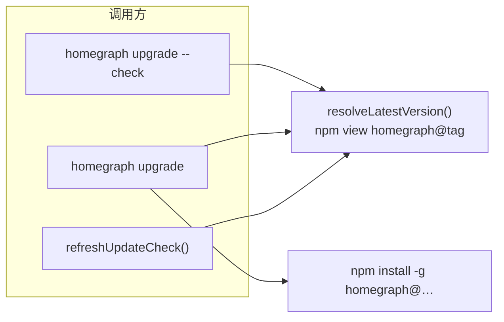

# 0018 — Update 版本源切换至 npm


| 字段 | 内容 |
| --- | --- |
| 编号 | 0018 |
| 类型 | 修复 / 变更 |
| 状态 | 已完成 |
| 日期 | 2026-08-27 |
| 范围 | `homegraph upgrade` 与 MCP 后台更新检查（`update-check`）的最新版本解析；测试与文档 |
| 关联 | [#1243](https://github.com/fujiaxin-coder/homegraph/issues/1243) 更新可见性；deveco-cli `src/update/`（npm 驱动参考实现）；[0004](./0004-remove-telemetry.md)（更新检查与遥测解耦） |


---

## 1. 背景与问题

HomeGraph 的安装与升级路径已是 **npm**（`npm i -g homegraph`；`homegraph upgrade` 对 npm 安装执行 `npm install -g homegraph@…`）。但「最新版本是多少」仍通过 **GitHub Releases** 解析：

- `src/upgrade/index.ts`：`REPO = 'homegraph/homegraph'`，`resolveLatestVersion()` 先读 `github.com/<repo>/releases/latest` 重定向，再 fallback GitHub API。
- `src/upgrade/update-check.ts`：后台检查复用同一 `resolveLatestVersion()`，结果缓存于 `~/.homegraph/update-check.json`。

**现状缺陷（已复现）：**

| 检查项 | 结果 |
| --- | --- |
| `GET api.github.com/repos/homegraph/homegraph/releases/latest` | **404**（仓库不存在） |
| `npm view homegraph version` | **正常**（如 `1.5.4`） |
| `homegraph upgrade --check`（未 pin 版本） | **失败**：`could not resolve the latest version from GitHub` |
| MCP `refreshUpdateCheck()` | **静默失败**，initialize instructions / stderr **无更新提示** |

canonical 代码仓在 GitCode（`ProgramAnalysis/homegraph`）；GitHub 镜像为 `fujiaxin-coder/homegraph`（见 `scripts/mirror-to-github.js`），用于 Release CI。**用户-facing 的安装与发版事实源是 npm**，不是 GitHub org/repo 字符串。继续依赖 GitHub 会导致：

1. 版本解析与真实安装源漂移（upgrade 装 npm、check 查 GitHub）；
2. 错误 `REPO` 常量使整条 update 链路失效；
3. 与 deveco-cli 已验证的 npm update-check 方案不一致，增加集成 homegraph 时的认知负担。

---

## 2. 目标

1. **单一事实源**：`resolveLatestVersion()` 默认从 **npm registry** 读取 `homegraph` 包的最新可安装版本。
2. **行为对齐**：`homegraph upgrade --check`、MCP 后台 `update-check`、未来 `devecocli graph status` 等调用方共享同一解析函数，不再各自查 GitHub。
3. **契约不变**：update-check 现有不变量保持——不阻塞 MCP 握手、fail silent、24h TTL / 1h 失败退避、`HOMEGRAPH_NO_UPDATE_CHECK` / `DO_NOT_TRACK` 仍生效。
4. **可测**：单元测试覆盖 npm 解析成功/失败/超时，不依赖外网（mock `spawn` 或注入 `resolveLatest`）。

---

## 3. 范围

### 3.1 纳入

| 项 | 说明 |
| --- | --- |
| `resolveLatestVersion()` | 改为 npm 主路径；更新错误文案（不再写 “from GitHub”） |
| `REPO` 常量 | 删除或标记 `@deprecated` 且不再被 update 路径引用；若仍有脚本/测试引用则改为文档注释中的镜像说明 |
| `parseLatestTagFromLocation()` | 若仅服务 GitHub 重定向解析且无其他调用方，删除；否则保留但移出 update 热路径 |
| `update-check.ts` 模块注释 | “GitHub release” → “npm registry latest” |
| 测试 | `test/upgrade.test.ts`：npm 解析 mock；`test/update-check.test.ts`：行为不变（仍 mock `resolveLatest`）；新增 npm 解析专项用例 |
| CHANGELOG | `[Unreleased]` Fixes 一条用户向说明 |
| 文档 | `README.md` / `docs/RELEASE.md` / `deveco-cli/docs/homegraph-integration.md` 中「查 GitHub latest」表述改为 npm（若存在） |

### 3.2 不纳入

- **不**改 `homegraph upgrade` 的安装方式（仍 `npm install -g`）；
- **不**改 update-check 的 TTL、缓存路径、MCP 展示面逻辑（除非顺带修正 `homegraph_status` 未接 `getUpdateNotice`——见 §6 可选跟进）；
- **不**在 `devecocli update` 内嵌 homegraph 版本检查（属 deveco-cli 集成 Spec，本 Spec 只修 homegraph 自身）；
- **不**引入 `blockedVersions` 召回门（deveco-cli 特有，homegraph 无 npm 包 metadata 约定）；
- **不**要求 GitCode / GitHub 镜像仓库改名或发版流程变更。

---

## 4. 设计

### 4.1 版本解析（npm 主路径）

**推荐实现**（与 `deveco-cli` `update _check` 对齐，略简化）：

```text
npm view homegraph@<dist-tag> version
```

- **包名**：复用已有 `NPM_PACKAGE = 'homegraph'`。
- **dist-tag**：默认 `latest`；可选读取 `process.env.npm_config_tag`（与 npm 全局/项目 tag 配置一致），无则 `latest`。
- **返回值**：经现有 `normalizeVersion()` 规范为 `vX.Y.Z`（npm 返回无 `v` 前缀）。
- **超时**：upgrade 前台检查沿用 ~12s；update-check 后台沿用现有 `UPDATE_CHECK_NETWORK_TIMEOUT_MS`（5s），可注入。

**调用方式**：

- 优先 `child_process.spawnSync('npm', ['view', spec, 'version'], { encoding: 'utf-8', timeout })`（与 upgrade 已用 npm 一致）。
- Windows：与 `npmInvocation()` 相同，经 `cmd.exe /d /s /c npm …`  spawn（#1238 已验证）。
- spawn 失败 / 非 0 / 输出非 semver → 抛错，由 `update-check` fail silent 或 upgrade 前台报错。

**不再**对 GitHub `/releases/latest` 或 `api.github.com` 发请求作为默认路径。

### 4.2 与 upgrade / update-check 的关系



- `update-check` **仅**调用 `resolveLatestVersion`；改一处即可修复 MCP 提示与 CLI check。
- pin 版本（`homegraph upgrade 1.5.4` / `HOMEGRAPH_VERSION`）逻辑不变，不经过 latest 解析。

### 4.3 错误与离线行为

| 场景 | `upgrade --check` | `update-check`（MCP） |
| --- | --- | --- |
| npm 超时 / 网络不可达 | stderr 错误 + exit 1 | fail silent；写 `lastAttemptAt` 触发 1h backoff；保留旧 `latest` |
| npm 返回非 semver | 同上 | 视为失败尝试，不更新 `latest` |
| 已是最新 | exit 0，绿色提示 | `getUpdateNotice()` → `null` |
| `HOMEGRAPH_NO_UPDATE_CHECK=1` | 不适用（upgrade 仍可用） | 无网络、无 notice |

错误文案示例：

```text
could not resolve the latest version from npm. Check your network, or pin a version: `homegraph upgrade <version>`.
```

### 4.4 环境变量（本 Spec 新增/明确）

| 变量 | 默认 | 说明 |
| --- | --- | --- |
| `npm_config_tag` | `latest` | npm dist-tag，与 `npm publish --tag` 一致 |
| `HOMEGRAPH_NO_UPDATE_CHECK` | — | 已有；关闭 MCP 后台检查 |
| `DO_NOT_TRACK` | — | 已有；同上 |

不新增 `HOMEGRAPH_NPM_REGISTRY`；自定义 registry 沿用用户 `~/.npmrc` / `npm_config_registry`（npm CLI 行为）。

### 4.5 测试策略

1. **纯函数**：保留 semver 比较、`normalizeVersion` 等现有测试。
2. **npm 解析**：注入 mock `runNpmView` 或 mock `spawnSync`，断言包名、tag、超时、Windows cmd 路由。
3. **update-check**：现有 20 条用例保持 green（已 mock `resolveLatest`）。
4. **集成（可选、非 CI 必跑）**：本地 `npm view homegraph version` smoke。

删除或改写依赖 `homegraph/homegraph` GitHub URL 的测试期望（如 `parseLatestTagFromLocation` 用例可保留作历史工具函数测试，与 update 路径解耦）。

---

## 5. 验收标准

- [x] `resolveLatestVersion()` 默认通过 npm 取得 latest，返回 `vX.Y.Z`；不再请求 `github.com/homegraph/homegraph`。
- [x] `homegraph upgrade --check` 在可访问 npm registry 时成功；当前版本低于 npm latest 时提示升级。
- [x] MCP 启动后 `~/.homegraph/update-check.json` 在 TTL 外会写入 npm 解析的 `latest`；旧版本 server 的 initialize instructions 出现更新提示（需 `HOMEGRAPH_NO_UPDATE_CHECK` 未设置）。
- [x] 离线 / mock npm 失败：upgrade 报错；update-check 不抛、不刷屏，backoff 生效。
- [x] Windows npm spawn 路径仍经 `npmInvocation` 或等价逻辑（若有独立 npm view 封装则复用）。
- [x] `npm test` 通过；新增/更新测试覆盖 npm 解析分支。
- [x] CHANGELOG `[Unreleased]` 有 Fixes 条目；相关文档不再写「查 GitHub latest」作为 update 版本源。

---

## 6. 可选跟进（本 Spec 不阻塞）

| 项 | 说明 |
| --- | --- |
| `homegraph_status` 展示 update notice | CHANGELOG #1243 声称含 status，但 `handleStatus()` 未调用 `getUpdateNotice()`；可开 0019 或在本 Spec PR 顺带一行 |
| deveco-cli 联动 | `devecocli graph status` 读 npm 比较 homegraph 版本；依赖本 Spec 修复后的语义 |
| dist-tag 文档 | 若团队使用 `next` tag 发 beta，在 README 说明 `npm_config_tag=next` |

---

## 7. 非目标

- 不实现自动升级（仍提示用户执行 `homegraph upgrade`）；
- 不把 update-check TTL 改为 deveco-cli 的 21:00 窗口；
- 不用 GitCode API 作版本源。

---

## 8. 回滚

还原 `resolveLatestVersion` 与相关测试；恢复 GitHub 解析。回滚后 update 链路仍可能因错误 `REPO` 失效——仅作紧急 revert 用，不建议长期保留 GitHub 主路径。

---

## 9. 参考

- 实现：`src/upgrade/index.ts`、`src/upgrade/update-check.ts`
- 对照：`deveco-cli/src/commands/update.ts`（`npm view ${pkgName}@${publishTag} --json`）
- 镜像说明：`scripts/mirror-to-github.js`、`docs/RELEASE.md`
